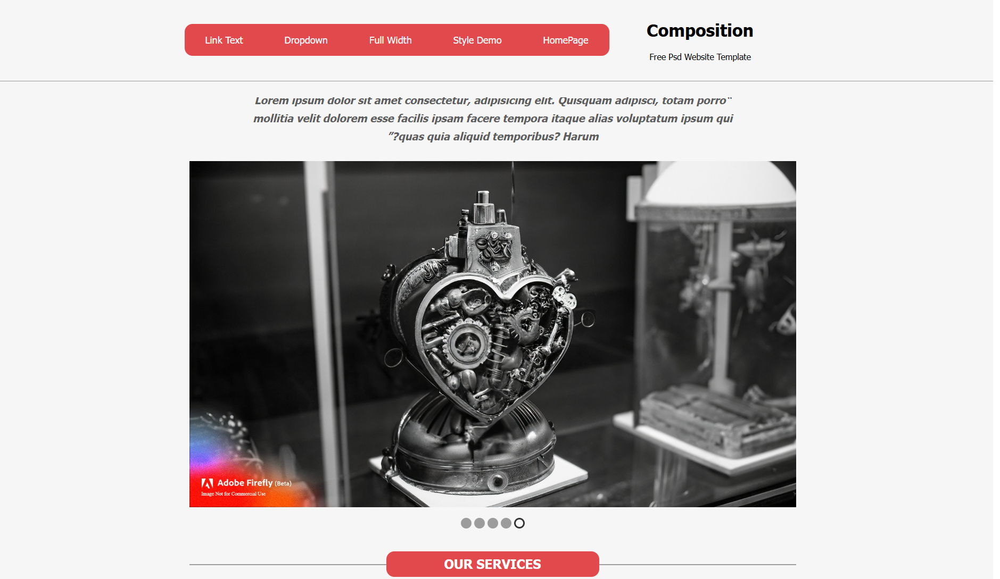
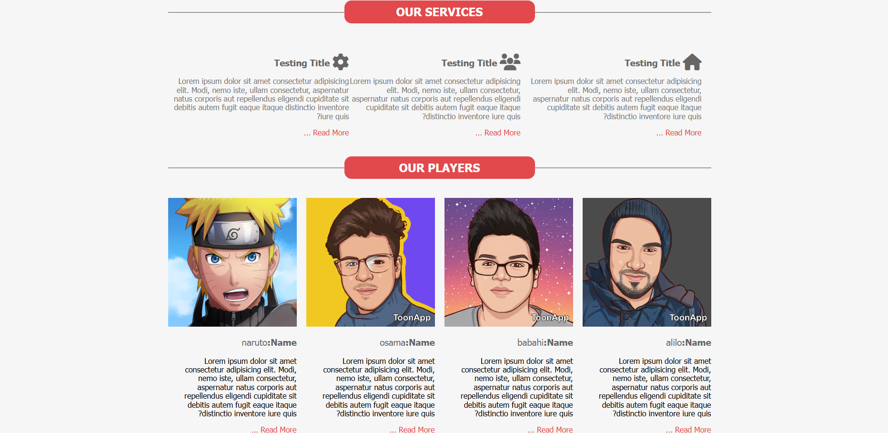
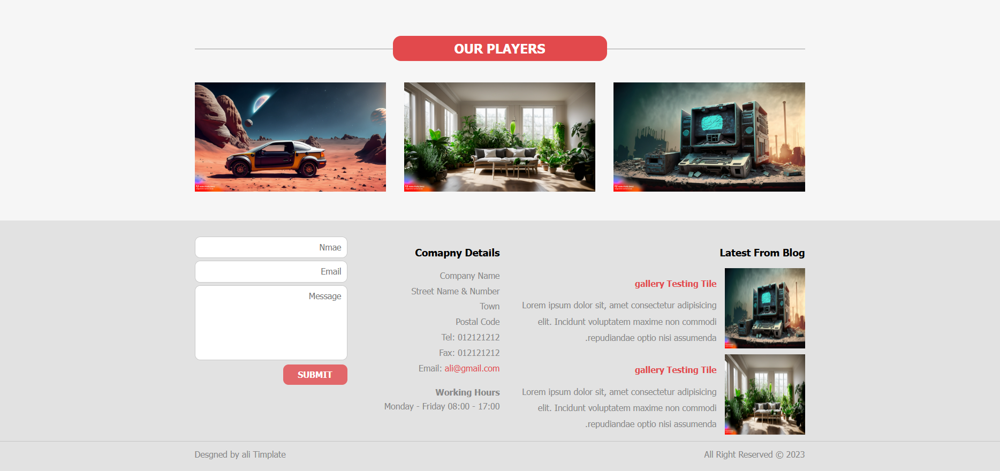
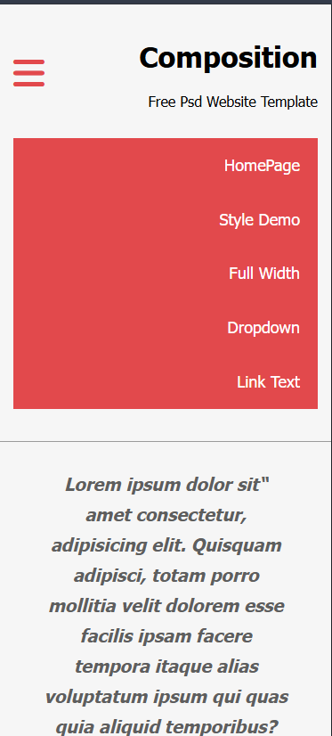

# Composition — Pure SASS Website Template

> A clean, fully responsive website template built **from scratch** with **HTML5**, **CSS3**, and **SASS/SCSS** — no frameworks, no dependencies. Includes full **RTL (Arabic) support** and a modular SASS architecture.

---

## 📸 Preview

| Desktop View | Mobile View |
|---|---|
|  |  |
|  |  |


---

## ✨ Features

- **Zero Framework** — Built entirely with custom HTML5, CSS3, and SASS (no Bootstrap, no Tailwind)
- **Modular SASS Architecture** — Clean file separation following a component-based structure
- **LTR & RTL Support** — Two full versions: `index.html` (English/LTR) and `indexrtl.html` (Arabic/RTL)
- **Custom Grid System** — Hand-crafted responsive container with Bootstrap-like breakpoints
- **Cross-Browser Prefixer Mixin** — Auto-generates `-webkit-`, `-moz-`, `-o-`, `-ms-` prefixes
- **Responsive Navbar** — Hamburger toggle on mobile with smooth height animation via Vanilla JS
- **SASS Variables** — Centralized colors, breakpoints, and transitions for easy theming
- **Reusable Mixins** — Media queries, overlay, prefixer, and keyframe animation helpers
- **Font Awesome 6** — Self-hosted icon pack (no CDN dependency)
- **Normalize.css** — Cross-browser style reset included

---

## 🗂️ Project Structure

```
templete_Sass/
├── index.html              # LTR version (English)
├── indexrtl.html           # RTL version (Arabic)
│
├── css/
│   ├── homepage.css        # Compiled LTR stylesheet
│   ├── homepage.scss       # LTR main SASS entry point
│   ├── homepagertl.css     # Compiled RTL stylesheet
│   ├── homepagertl.scss    # RTL main SASS entry point
│   ├── normalize.css       # Browser reset
│   ├── all.min.css         # Font Awesome 6
│   ├── prepros.config      # Prepros compiler config
│   │
│   └── sass/
│       ├── helpers/
│       │   ├── _variables.scss     # Colors, breakpoints, transitions
│       │   ├── _mixins.scss        # Reusable SASS mixins
│       │   └── _functions.scss     # SASS utility functions
│       │
│       ├── components/
│       │   ├── _buttons.scss       # Button styles
│       │   └── _headings.scss      # Heading & title styles
│       │
│       ├── layout/
│       │   ├── _grid.scss          # Custom container & grid system
│       │   ├── _header.scss        # Navbar & logo
│       │   └── _footer.scss        # Footer layout
│       │
│       └── pages/
│           ├── _globalpage.scss    # Shared page styles
│           ├── _homepage.scss      # Home page specific styles
│           └── _aboutus.scss       # About page styles
│
├── js/
│   └── index.js            # Vanilla JS — mobile navbar toggle
│
├── img/
│   ├── slider.jpg          # Hero section image
│   ├── img5.jpg, img6.jpg, img8.jpg  # Gallery & footer images
│   └── a.png, b.png, o.png, naruto.png  # Player avatars
│
├── webfonts/               # Self-hosted Font Awesome 6 font files
│   ├── fa-solid-900.*
│   ├── fa-brands-400.*
│   ├── fa-regular-400.*
│   └── fa-v4compatibility.*
│
└── imageGithub/            # Preview screenshots for README
    └── 1.png – 8.png
```

---

## 📐 SASS Architecture

### Variables (`_variables.scss`)

| Variable | Value | Purpose |
|---|---|---|
| `$redColor` | `#e2494c` | Primary accent color |
| `$greyColor` | `#9c9c9c` | Secondary / border color |
| `$transition` | `0.3s` | Global transition speed |
| `$maxMobile` | `max-width: 767px` | Mobile breakpoint |
| `$maxSmall` | `max-width: 991px` | Small breakpoint |
| `$minSmall` | `min-width: 768px` | Tablet and up |
| `$minMedium` | `min-width: 992px` | Desktop breakpoint |
| `$minLarge` | `min-width: 1200px` | Large screen breakpoint |

### Mixins (`_mixins.scss`)

```scss
// Responsive media query
@mixin minMedium { ... }

// Overlay helper — adds a colored overlay on a positioned element
@mixin overlay($color, $opacity) { ... }

// Cross-browser CSS property prefixer
@mixin prefixer($property, $value, $prefixes: ()) { ... }

// Cross-browser @keyframes generator
@mixin keyFrame($animation-name) { ... }
```

### Usage example

```scss
// Using the prefixer mixin
* {
  @include prefixer(box-sizing, border-box, $web $mozilla);
}

// Using the overlay mixin
.slider::before {
  @include overlay(#000, 0.4);
}

// Using media query variables
.container {
  @media #{$minLarge} {
    width: 1170px;
  }
}
```

---

## 📄 Pages & Sections

### `index.html` (LTR) & `indexrtl.html` (RTL)

Both pages contain the same layout, mirrored for text direction:

| Section | Description |
|---|---|
| **Header** | Logo + responsive navbar with hamburger toggle on mobile |
| **Slider** | Hero image with a blockquote and bullet indicators |
| **Services** | Three service cards with Font Awesome icons and "Read More" links |
| **Our Players** | Four player cards with avatars, names, and descriptions |
| **Gallery** | Three-column image layout |
| **Footer** | Three columns: Latest Blog posts, Company Details, Contact Form |
| **Copyright Bar** | Full-width bottom bar with rights and author credit |

---

## 🚀 Getting Started

### 1. Clone the repository

```bash
git clone https://github.com/your-username/templete_Sass.git
cd templete_Sass
```

### 2. Open in your browser

No build step needed to view the site — the CSS is already compiled:

```bash
# macOS
open index.html

# Linux
xdg-open index.html

# Windows
start index.html
```

> **Tip:** Serve locally for the best experience:
> ```bash
> python -m http.server 8080
> ```
> Then visit `http://localhost:8080`

---

## 🛠️ Editing SASS Source Files

If you want to modify the styles, you need to compile the SASS files back to CSS.

### Option 1 — Prepros (Recommended, GUI)
A `prepros.config` file is already included. Simply open the project folder in [Prepros](https://prepros.io/) and it will auto-compile on save.

### Option 2 — Sass CLI

```bash
# Install Sass globally
npm install -g sass

# Watch and compile LTR
sass --watch css/homepage.scss css/homepage.css

# Watch and compile RTL
sass --watch css/homepagertl.scss css/homepagertl.css
```

### Option 3 — VS Code Extension
Install the **Live Sass Compiler** extension by Glenn Marks and click "Watch Sass" in the status bar.

---

## 🌐 RTL Support

The project ships with a full **RTL (Right-to-Left)** version for Arabic content:

| File | Direction | Language |
|---|---|---|
| `index.html` + `homepage.css` | LTR ← | English |
| `indexrtl.html` + `homepagertl.css` | RTL → | Arabic |

To switch the default direction, change the `$text-align` variable in `_variables.scss`:

```scss
// LTR
$text-align: left;

// RTL
$text-align: right;
```

---

## 🛠️ Built With

| Technology | Purpose |
|---|---|
| HTML5 | Semantic page structure |
| CSS3 | Styling & animations |
| [Sass/SCSS](https://sass-lang.com/) | CSS preprocessor — variables, mixins, nesting |
| Vanilla JavaScript (ES6) | Mobile navbar toggle |
| [Font Awesome 6](https://fontawesome.com/) | Self-hosted icon library |
| [Normalize.css](https://necolas.github.io/normalize.css/) | Cross-browser CSS reset |
| [Prepros](https://prepros.io/) | SASS compiler (optional) |

---

## 🌐 Browser Support

| Browser | Support |
|---|---|
| Chrome | ✅ Latest |
| Firefox | ✅ Latest |
| Safari | ✅ Latest |
| Edge | ✅ Latest |
| IE 11 | ⚠️ Partial |

---

## 📝 Customization Tips

- **Primary color:** Change `$redColor` in `_variables.scss` to update the navbar and accent color across the whole site.
- **Brand name:** Replace `Composition` in the `<h1>` tag inside `.header .logo`.
- **Navbar links:** Edit the `<ul class="navbar">` in both HTML files.
- **Hero image:** Replace `img/slider.jpg` with your own image.
- **Player / Team cards:** Update names, images, and descriptions in the `.our-players` section.
- **Footer contact info:** Edit the `.info ul` block inside `<footer>`.
- **Adding a new page:** Create a new `.scss` file under `css/sass/pages/`, then import it in `homepage.scss`.

---

## 📜 License

This project is open-source and available under the [MIT License](LICENSE).

---

## 🙋 Author

**Ali Alaedine**
- GitHub: [@BoutefahaAlaeddine](https://github.com/BoutefahaAlaeddine)

---

> ⭐ If you found this template useful, consider giving it a star on GitHub!
